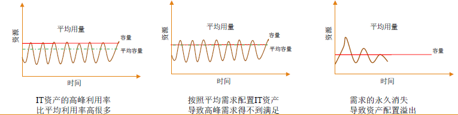
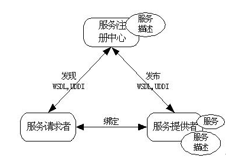
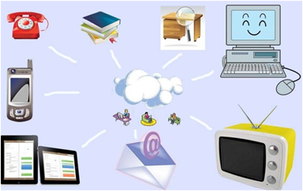

# 第一章 云计算概论

## 第一节 什么是云计算

### 云是网络、互联网的一种比喻说法

### 云计算（cloud computing）是基于互联网的相关服务的增加、使用和交付模式，通常涉及通过互联网来提供动态易扩展且经常是虚拟化的资源

### 美国国家标准与技术研究院（NIST）的定义：

​	云计算是一直**按使用量付费**的模式，这种模式提供可用的、便捷的、按需的网络访问，进入**可配置的计算资源共享池**（资源：网络、服务器、存储、应用软件、服务），这些资源能够被快速提供，只需投入**很少的管理工作**，或与服务供应商进行很少的交互

## 第二节 云计算的产生背景

### 云计算是继1980年代大型计算机到客户端-服务器的大转变之后的又一种巨变

### 云计算是分布式计算（Distributed Computing）、并行计算（Parallel Computing）、效用计算（Utility Computing）、网络存储（Network Storage Technologies）、虚拟化（Virtualization）、负载均衡（Load Balance）、热备份冗余（High Available）等传统计算机和网络技术发展融合的产物

## 第三节 云计算的发展历史

| 年份 | 云计算的发展                                                 |
| :--: | ------------------------------------------------------------ |
| 1983 | 网络是电脑                                                   |
| 2006 | Amazon：弹性计算云服务（EC2） Google：云计算概念        |
| 2007 | Google与IBM：高校推广，提供技术支持                          |
| 2008 | IBM：第一个云计算中心 戴尔：申请云计算商标              |
| 2010 | Novell与CSA：可信任云计算计划                                |
| 2013 | 中国IaaS：市场规模约为10.5亿元 中国PaaS：市场规模增长近20% 全球SaaS：云计算领域最为成熟的细分市场 |
| 2015 | 云计算方面的相关政策不断更新                                 |

## 第四节 云计算的本质

云计算的规模效应

- 案例：需要大量存储容量，设计一个存储解决方案
- ​	构建独享的存储框架、购买网络存储设备、使用AWS
- 低利用率场景无法避免，因为高峰利用率可能达到80%甚至更高
- ​	非高峰阶段出现大量资源浪费

## 第五节 本章小结

云计算作为一种新型的计算模式，利用高速互联网的传输能力将数据的处理过程从个人计算机或服务器转移到互联网上的计算机集群中，带给用户前所未有的计算能力

云计算的产生与发展，使用户直接面对的将不再是复杂的硬件和软件，而是最终的服务

云计算将计算任务发布在大量计算机构成的资源池上，使各种应用系统能够根据需要获取计算力、存储空间和各种软件服务

云计算现在还存在着一些问题，但是它的优点是毋庸置疑的。云计算不仅大大降低了计算的成本，而且也推动了互联网技术的发展。

# 第二章 云计算基础

本章主要介绍关于云计算的各种基础知识，包括分布式计算、云计算的基本概念、实现云计算的几种关键技术以及云交付和部署模式，同时介绍云计算有哪些优势以及面临的挑战以及几种典型的云应用。通过本章的学习，应能够对云计算有一个基本的认识。

## 第一节 分布式计算

+ 分布式计算将应用分解成许多更小的部分，分配到多台计算机进行处理，这里可以节省整体计算时间，大大提高计算效率

+ 云计算是分布式计算技术的一种，也是分布式计算这种科学概念的商业实现。分布式计算的优点是发挥“**集体的力量**”

+ 分布式计算的一种应用是Web Service

  

分布式计算的应用

+ **P2P** 用户下载的文件不是集中放到某个中心，而是分别存储在网络中不同节点，当用户有下载需求时，可以从网络上的节点中获取相应资源碎片，并形成下载文件。比如用迅雷下载文件的方式就是采用P2P方式
+ **CDN** 将视频网站中的内容分布存储在就近的服务器上，从而形成分布式网络
+ **区块链** 将账目信息记录在不同的节点，当交易发生时，更新网络上所有账目副本；应用架构中的分布式计算架构多应用于微服务

## 第二节 云计算的基本概念

+ 云计算的“云”就是存在于互联网上的服务器集群上的软件和硬件资源

+ 云计算是一种商业计算模型，它**将计算任务发布在大量计算机构成的资源池**上，使用户能够按需获取计算力、存储空间和信息服务

  

### 云计算的组成部分

云计算的组成可以分为6个部分，从下至上分别是：

+ 基础设施（Infrastructure）
+ 存储（Storage）
+ 平台（Platform）
+ 应用（Application）
+ 服务（Services）
+ 客户端（Clients）

### 基础设施

云基础设施，即IaaS（Infrastructure as a Service），是经过虚拟化后的硬件资源和相关管理功能的集合，对内通过虚拟化技术对物理资源进行抽象，对外提供动态、灵活的资源服务。

+ Sun的Sun网格（Sun Gird）
+ Amazon的弹性计算云（Elastic Computer Cloud,EC2）

### 存储

云存储涉及提供数据存储作为一项服务，包括类似数据库的服务，通常以使用的存储量为结算基础。

全球网络存储工业协会（SNIA）为云存储建立了相应标准。它既可交付作为云计算服务，又可以交付给单纯的数据存储服务

+ 谷歌应用程序引擎的BigTable数据存储
+ Amazon的简单存储服务（Simple Storage Service, S3）

### 平台

云平台，即PaaS（Platform as a Service），直接提供计算平台和解决方案作为服务，以方便应用程序部署，从而节省购买和管理底层硬件和软件的成本。

+ 谷歌应用程序引擎(Google App Engine)，这种服务让开发人员可以编译基于Python的应用程序，并可免费使用谷歌的基础设施来进行托管。

### 应用

云应用利用云软件架构，往往不再需要用户在自己的电脑上安装和运行该应用程序，从而减轻软件维护、操作和售后支持的负担。

+ Facebook的网络应用程序
+ 谷歌的企业应用套件(Google Apps)

### 服务

云服务是指包括产品、服务和解决方案都实时地在互联网上进行交付和使用。这些服务可能通过访问其他云计算的部件，比如软件，直接和最终用户通信。

+ Amazon简单排列服务(Simple Queuing Service)谷歌的企业应用套件(Google Apps)
+ 贝宝在线支付系统(PayPal)
+ 谷歌地图(Google Maps)
